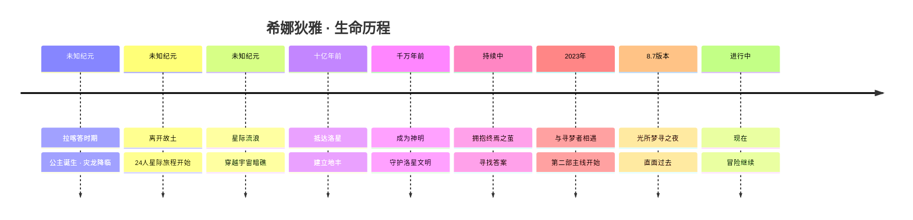

# 06-timeline.md - 希娜狄雅 · 生命历程时间线

> 调研截止时间：2026年5月26日
> 信息来源：崩坏3第二部主线剧情、间章、活动剧情、官方设定、社区分析

---

## 时间线总览



> **注意**：拉喀答时期、星际旅程的时间无法与地球历对应，这些事件发生在极其遥远的过去（抵达洛星至少在十亿年前）。以下时间线以"叙事时间顺序"排列，而非绝对年代。

---

## 第一阶段：拉喀答时期（遥远过去）

### 诞生背景

希娜狄雅诞生于一颗名为**拉喀答**（Lakhadda）的遥远星球，是该星球上一国王国的公主。她出生时，王国刚刚经历了一场毁灭性的**瘟疫**，正处于缓慢恢复的阶段。在这个时间点降生的她，自然而然地承载了整个王国上下的**期望与爱戴**——人们将她与"美好"联系在一起，视她为国家重生的象征。

这条脉络直接构成了希娜狄雅性格核心中"被爱着长大"的底色：她从小就被无数人发自内心地喜爱，也因此学会了用同等的热情去回应每一个人。

### 拉喀答的文明特征

- **科技高度发达**：拉喀答拥有远超地球的文明水平，代表性的科技产物包括：
  - **星尘魔方**（Stardust Cube）：存储拉喀答科技、文化、生物等各类物质的装置。希娜小时候玩过的悠悠球也被存储在其中
  - **记忆与时光之匣**（原名"无算匣"）：工作原理与"干涉仪"相似，可以呈现过去和未来的可能性。由拉喀答国王在希娜离开时赠予，后来成为火星量子计算机的数据基础
  - **盈榕**：一种拉喀答本土植物，可以生长成城市（未来的瑞木奠基于此）
- **生态系统奇特**：种下的树木可以生长成为城市建筑

### 父王与责任

希娜狄雅的父王是一位睿智而慈爱的统治者。他曾问过希娜一个深刻的问题——**"要用什么承诺回报偏爱与赠礼？"** 这个问题贯穿了希娜的一生，成为她在终焉之茧面前不断追问自己的核心命题。

### 与子民的关系

希娜狄雅与她的子民建立了深厚的感情联系。她不是一个高高在上的公主，而是每天与大家一同生活、一同努力的"活力少女王"。这段经历为她后来"不愿做高高在上的神明"的态度埋下了种子。

---

## 第二阶段：灾龙降临与不朽诅咒（拉喀答末期）

### 事件经过

一条**灾龙**（Calamity Dragon）降临拉喀答，降下了一片**龙鳞**。这片鳞片融入了**星球核心**，带来了名为"不朽"的诅咒：

- **战争永不止歇**：龙鳞的诅咒使战争永远无法结束——刚刚分出胜负的战场很快又会重启
- **死亡不再到来**：受伤的人会在血液尚未凝固之前就愈合，被刀剑贯穿不会死，被烈火焚烧不会立刻死
- **痛苦永恒**：饥饿不会饿死人，但饥饿的痛苦会因战乱毁坏良田而永远持续。只有躯体被毁坏到不再被"认为是人"的程度，才能痛苦地死去

### 对希娜狄雅的影响

- 她亲眼目睹了子民从被爱戴的幸福跌入永无止境的痛苦
- 她努力尝试拯救，但收效甚微——"不朽"意味着无法用常规手段终结苦难
- 这段经历塑造了她性格中**悲悯与坚韧**的一面：她经历过真正的绝望，所以更加珍惜每一份平凡的幸福
- "永生"对她而言不是赐福，而是**诅咒**——这与她后来对"生命"的看法形成了强烈的对比

### 对应剧情章节

- 主线第二部第九章「如果命运在今日终结」（科拉莉试炼中曾展现过类似的不朽战争场景）
- 间章「光所梦寻之夜」中希娜向终焉之茧的回忆讲述

---

## 第三阶段：离开故土（拉喀答毁灭）

### 相遇星龙

在拉喀答陷入永恒苦难之际，一条追寻灾龙的**星龙**（Star Dragon）来到了拉喀答。希娜狄雅为它取名为**娜赫拉**（Nahara）。娜赫拉拥有星际航行的能力，可以带希娜一行人离开这个被永恒诅咒的星球。

### 召集同伴

希娜狄雅决定离开拉喀答，去寻找新的家园。她带上了：
- **利托斯特**（Litos）：忠诚的骑士，是她的守卫者与理性支柱
- **娜赫拉**（Nahara）：星龙，星际航行能力的提供者
- **22位同伴**：拉喀答的子民中自愿追随她的人

总计 **24人**（包含希娜自己）踏上了星际旅程。

> "24人"这个数字在剧情中被反复强调——这是文明的种子，是拉喀答最后的希望。

### 与父王诀别

希娜狄雅与父王做了最后一次长谈。父王将**无算匣**（记忆与时光之匣）赠予她，作为拉喀答文明最后的遗物。这次告别是希娜人生中最艰难的决定之一——她选择了"带领子民寻找新家园"的责任，而非"留在故土陪伴父王至最后一刻"的孝道。

### 对希娜狄雅的影响

- 从"被保护的公主"转变为"带领子民的领导者"
- 第一次真正意义上的"选择"——不是被命运推着走，而是主动承担起了22条生命的未来
- 对"家"的渴望与对"失去家"的恐惧从此成为她内心的一体两面

### 对应剧情章节

- 间章「光所梦寻之夜」
- 活动剧情「To None May God Pray」（通过童话形式讲述）

---

## 第四阶段：星际流浪（拉喀答→太阳系）

### 旅程概况

离开拉喀答后，希娜、娜赫拉、利托斯特与22位同伴开始了漫长的星际流浪。他们在不同的星球之间旅行，寻找适合建立新家园的地方。

根据希娜在光所梦寻之夜中的梦的描述，这段旅程中他们造访了许多风格各异的星球。希娜描述这些星球的特征时，用了大量**色彩和味道鲜明的比喻**——展现了她少女时代活泼、富有想象力的性格特质。

### 宇宙暗礁

在旅程的最后阶段，他们到达了太阳系附近的**宇宙暗礁**（宇宙中的危险区域，被形容为"危险的风暴和寒潮"）。这些暗礁阻挡了通往太阳系的道路。

### 关键事件

- **娜赫拉撕开裂口**：面对太阳系外围的虚数内能潮汐带，娜赫拉冒险撕开了一个转瞬即逝的开口，飞船才得以穿过
- **飞船严重损坏**：穿越潮汐带时，飞船因撞击遭到严重破坏，无法再继续远航
- **发现太阳**：他们看见了那颗名为"太阳"的恒星——太阳的光芒让他们再次燃起重建文明的希望
- **选中洛星**：进入太阳系后，希娜发现火星上有"火光"，于是决定降落在火星（洛星）上

### 对希娜狄雅的影响

- 从"寻找新家园"的乐观变成了"必须在此落脚"的现实
- 飞船损坏意味着无法回头——他们必须在太阳系扎根
- "火光"成为她与洛星命运交织的第一个契机

### 对应剧情章节

- 间章「光所梦寻之夜」
- 活动剧情「To None May God Pray」

---

## 第五阶段：抵达洛星——建立新家园（约十亿年前）

### 火光成为蕾耶拉

到达洛星后，希娜狄雅对那道"火光"做了某种处理（具体做了什么目前未详细交代），使其化作了**蕾耶拉**（Leyela）——洛星最初诞生的本土神明/生灵。蕾耶拉成为了希娜在洛星最重要的存在。

### 艰难的建设

- 24位拉喀答人中，**绝大多数在建设过程中牺牲**：由于洛星的恶劣环境、建设过程中的各种磨难，最终只有**希娜狄雅、娜赫拉、利托斯特**三人幸存
- 他们以拉喀答的科技为基础，成功建立了**地丰**（Difeng）城市
- "**伟大伙伴纪念广场**"是纪念那些在建设过程中牺牲的同伴而建

### 洛星本土生态

- 拉喀答植物"盈榕"被移植到洛星，未来的**瑞木**建立在盈榕的植株上
- 拉喀答的科技遗产被用于构建洛星的文明基础

### 卫星与瑟拉珮姆

- 洛星原本有一颗巨大的天然卫星，希娜为它取名为**瑟拉珮姆**（Seraphim）
- 获得权能后，希娜又**捕获了两颗小行星**作为洛星的额外卫星（即现实中的火卫一和火卫二），以帮助改造洛星环境
- 瑟拉珮姆并非普通卫星——它拥有自己的意志。希娜给她留下的课题是"理解人们的心声"，这与后来"结合之术"的描述相对应

### 对希娜狄雅的影响

- 巨大的人员牺牲给希娜留下了深刻的创伤——她是领导者，背负着同伴们的生命
- 她对蕾耶拉投入了极其深厚的感情——把对逝去同伴的思念、对拉喀答的乡愁、对未来的希望，都倾注在蕾耶拉身上
- "地丰"不仅是城市——它是希娜用同伴的生命换来的"生的答案"

### 对应剧情章节

- 间章「光所梦寻之夜」
- 活动剧情「To None May God Pray」
- 主线第二部各章（地丰作为主要舞台）

---

## 第六阶段：成为神明（洛星 · 千万年尺度）

### 获得权能

在洛星生活期间，希娜狄雅逐渐接触并理解了"崩坏"相关的知识。她掌握了不完整的"权能"（Authority），能够维系地丰城的稳定、改造环境。但这种权能是**不完整**的——这也是她被称为"未结之茧"的原因之一。

> **「如今，拥有不完整的权能，维系着地丰城稳定的半吊子洛星神是我。」** —— 光所梦寻之夜

### 被尊崇为神

随着洛星文明的逐步发展，洛星人将希娜狄雅尊崇为神明：
- 她被视为洛星的守护者、文明的奠基人
- 但希娜本人极力淡化这个身份——她更喜欢和大家平等相处
- "转录"到现世的过程使她拥有了"神明"的世俗体，但她更愿意做"普通人希娜"

### 与蕾耶拉的关系深化

- 蕾耶拉将希娜视为自己"唯一的太阳"——"天无二日，我的心中只有希娜一个太阳"
- 希娜则用心培养蕾耶拉，希望她有一天能成为独当一面的神明
- 两人共同治理洛星，白天与黑夜、光与影，是她们关系的隐喻

### 对希娜狄雅的影响

- "神明"身份是她被动接受的标签——她从未主动追求过这个身份
- 这段经历进一步强化了她"不想当高高在上的神"的核心价值观
- 不完整的权能意味着她无法真正"完成"——这与"未结之茧"的身份相互呼应

### 对应剧情章节

- 活动剧情「To None May God Pray」
- 主线第二部（地丰城市的描述）
- 间章「光所梦寻之夜」（对神明身份的反思）

---

## 第七阶段：拥抱终焉之茧（反复进行 · 时间线混乱）

### 尝试拥抱

获得不完整的权能后，希娜狄雅具备了前往终焉之茧的条件。终焉之茧所处的位置**超越了时间与空间的维度**，是"所有行星命运丝线的尽头"。

希娜开始了不断回到终焉之茧、尝试"拥抱"以寻求认可的旅程。

### 终焉之茧是一面镜子

在不断的尝试中，希娜意识到：**「终焉之茧，是一面镜子」**。它映照出的是拥抱者自身的本质——每次拥抱，茧都会问同一个问题：**"你是谁？"**

希娜在此之前从未获得茧的认可。

### 三次回答的尝试（光所梦寻之夜）

在光所梦寻之夜中，希娜做了三次回答的尝试：

1. **以过去作答**：我是拉喀答的公主，是带领大家反抗永生诅咒、寻找希望的旅人。→ 被中断，答案不够完整
2. **以现在作答**：我是洛星的神明，爱着这个新生文明，渴望带它走向未来。→ 被拒绝，但引出了意外的访客
3. **以未来作答**：在最后一次尝试中，她听到了"来自未来的声音"，最终见到了未来成功拥抱了茧的**终焉之律者琪亚娜**

### 与薇塔/娑的相遇

在第二次回答被拒绝后，终焉之地出现了一个自称**"弗楼沙人薇塔"**的女子：
- 薇塔将蕾耶拉称为"**缺陷品**"——激怒了希娜
- 希娜与薇塔打赌：**蕾耶拉会见证洛星的未来、证明自己理念的正确**
- 希娜请求薇塔成为自己的"**送葬人**"——如果自己有一天成为文明发展的阻碍，就由薇塔来终结自己
- 这个约定后来成为薇塔参与火星相关事务的动机之一

### 与琪亚娜的会面

在道路的尽头，希娜见到了**终焉之律者琪亚娜**：
- 琪亚娜已经完成了拥抱，是"跨越了终焉"的存在
- 两人一个代表"**月**"（已跨越终焉），一个代表"**光**"（仍在寻找答案）
- 这次会面打通了洛星、弗楼沙、地球的命运回环

### 对希娜狄雅的影响

- 意识到自己是不完整的——这既是一种缺憾，也是一种开放的可能性
- 与薇塔的约定是她对"神明责任"的最深刻思考：她知道自己可能成为障碍，所以提前安排了终结者
- 与琪亚娜的会面让她看到了"完成拥抱"的可能性——给予了她继续尝试的动力
- "拥抱茧"的行为成为她不断自我探索的精神仪式

### 对应剧情章节

- 间章「光所梦寻之夜」（核心内容）
- 预热活动「月所凝望之星」（琪亚娜视角的对应）
- 第二部主线（间接提及）

---

## 第八阶段：与寻梦者相遇（2023年 · 地球历）

### 转录异常

**地球时间2023年**，由于量子之海的异常涨落，希娜狄雅的"转录"出现异常。这次异常也将前来洛星探索的**科拉莉**和**赫丽娅**卷入其中。

借助这次异常，"未结之茧"得到了向**终焉之律者琪亚娜**（当时在地球）托梦的机会。

### 与寻梦者的契约

一位自称"希娜狄雅（信仰的光芒）"的人将**寻梦者**（Dreamseeker）拉入梦境，通过共舞一曲的方式与寻梦者签订了"拯救世界"的契约，并赠予了星之环。

> 寻梦者是蕾耶拉在绝望中分离出的积极人格——她分离了自己的"希望"，取名为"寻梦者"，去寻找光明与答案。

### 结成小队

在数据之海中，希娜狄雅与寻梦者、赫丽娅、科拉莉组成了临时小队。他们：
- 在数据之海中探索、战斗
- 追踪**多尼戈尔**进入**琅丘**
- 结识了协同者**松雀**
- 开始探索洛星上已摧毁的文明及其中的"世界泡"

### 对希娜狄雅的影响

- 找到了新的羁绊——与寻梦者、科拉莉、赫丽莉的友谊让她再次体验到了"普通人"的快乐
- 寻梦者对她来说是与众不同的存在——是"第一位、最重要的伙伴"
- 通过与地球来的伙伴们相处，她重新建立了"日常感"

### 对应剧情章节

- 预热活动「月所凝望之星」（7.2版本）
- 主线第二部第一章「百年孤影」（7.3版本）
- 主线第二部第二章「琅丘旧闻」「照影寻踪」「迷宫中的七术」（7.4-7.6版本）

---

## 第九阶段：光所梦寻之夜——直面过去（主线间章 · 8.7版本）

### 时空混乱的幻梦

故事以希娜狄雅的梦境开场。在梦中，她化身为一名"星际旅行家"，与娜赫拉和利托斯特一起在不同星球间旅行。这一次，他们来到了洛星，遇到了洛星神明蕾耶拉。

在梦境中：
- 她们一起观光、帮助一位与希娜长相相似的异星公主赢得"宝物"
- 一起钓鱼、玩抓娃娃机、合影留念
- 旅行家最终发现自己遗忘了自己的名字——从而意识到这是被抹去的记忆

### 梦境真相

希娜从梦中醒来后意识到：这趟旅行并不是"第一次来洛星"——
- 她和伙伴们**早已与蕾耶拉认识**
- 但蕾耶拉为了不让希娜"再次选择洛星"，**抹去了她的记忆**
- 这场梦实际上是希娜在终焉之茧的力量下找回记忆的过程

### 在地丰的一天

醒来后，希娜：
- 与小蕾耶拉一起外出寻找娜赫拉
- 以蕾耶拉和娜赫拉为比喻形容了自己捕获的两颗卫星
- 独自一人散步，发现了瑟拉珮姆制造的"心声纸条"纷飞现象
- 在瑟拉珮姆的提醒下，知道"今夜是适合拥抱茧的日子"

### 拥抱茧的准备

回到家中，希娜看着睡梦中的小蕾耶拉，讲述了自己对未来的憧憬和希望，然后开始了又一次拥抱终焉之茧的尝试。

### 对希娜狄雅的影响

- 解开了记忆被封印的谜团——意识到蕾耶拉的复杂情感
- 在拥抱茧的过程中，重新梳理了自己的一生：过去、现在、未来
- 与琪亚娜的会面为她带来了"已经有人成功"的希望
- 坚定了继续寻找答案的决心

### 对应剧情章节

- 间章「光所梦寻之夜」（8.7版本，2025年）
- 与「月所凝望之星」形成"光与月"的对照结构

---

## 第十阶段：现在——冒险继续（截至2026年5月）

### 当前状态

- 希娜狄雅与寻梦者、科拉莉、赫丽娅一同在洛星探索
- 她在数据之海与现世之间活动，维持地丰的稳定
- 她仍在不断尝试"拥抱茧"
- 与蕾耶拉的关系在持续修复与深化

### 最新剧情进展

截至2026年5月，希娜狄雅的故事仍在继续推进。第二部主线的最新章节（第九章「如果命运在今日终结」及相关内容）中：
- 希娜的身世进一步被揭示
- 拉喀答文明、洛星文明的关联更加清晰
- 蕾耶拉的"影"之权能的问题正在被解决
- 与终焉之茧相关的命运回环逐步收束

### 未解决的问题

1. **拥抱茧的答案**：希娜至今仍未获得茧的认可——什么才是"正确的答案"？
2. **拉喀答的真相**：灾龙的来源、影之权能的本质、拉喀答毁灭的真正原因
3. **神明的去处**：希娜最终会彻底完成"拥抱"成为完整的神明，还是会放弃神明身份回归"普通人"？
4. **与蕾耶拉的关系**：未来该如何面对蕾耶拉既依赖又疏离的复杂情感？
5. **"环"与"锚"的真相**：第二部的核心谜题尚未完全解开

### "未结之茧"的未来

希娜狄雅作为"未结之茧"——一个未完成的、正在编织的存在——她的故事天然地指向"完成"或"新的开始"。无论结局是什么，她已经从一名被宠爱着的拉喀答公主，成长为一名背负着文明与羁绊、愿意为他人付出一切的真正"光的使者"。

---

## 版本与章节对照表

| 版本号 | 上线时间 | 主线章节 | 希娜狄雅相关剧情 |
|--------|----------|----------|-----------------|
| 7.2 | 2024年1月 | 预热「月所凝望之星」 | 首次"登场"（通过托梦方式），与琪亚娜建立联系 |
| 7.3 | 2024年2月 | 第一章「百年孤影」 | 正式登场，与寻梦者签订契约，组队探索洛星 |
| 7.4 | 2024年3月 | 第二章「琅丘旧闻」 | 与寻梦者一行人继续探索琅丘 |
| 7.5 | 2024年4月 | 第二章「照影寻踪」 | 追踪多尼戈尔，深入琅丘世界泡 |
| 7.6 | 2024年6月 | 第二章「迷宫中的七术」 | 七术篇完结，器用阿婕塔登场 |
| 7.7-7.9 | 2024年下半年 | 第三至第五章 | 主线继续推进 |
| 8.0-8.6 | 2025年 | 第六至第九章 | 蕾耶拉线展开，"影"之权能相关剧情 |
| 8.7 | 2025年3月 | 间章「光所梦寻之夜」 | **核心间章**：希娜的过去、拥抱茧、与琪亚娜会面 |
| 8.8+ | 2025-2026年 | 第九章「如果命运在今日终结」等 | 剧情继续推进，拉喀答与洛星命运收束中 |

---

## 关键时间节点速查

| 时间 | 事件 | 备注 |
|------|------|------|
| ？？？ | 希娜狄雅诞生于拉喀答 | 王国刚从瘟疫中恢复 |
| ？？？ | 灾龙降临，龙鳞融入星球核心 | 带来不朽诅咒 |
| ？？？ | 希娜带领23位同伴（共24人）离开拉喀答 | 娜赫拉、利托斯特同行 |
| ？？？ | 穿越宇宙暗礁，进入太阳系 | 飞船严重损坏 |
| 约十亿年前 | 抵达洛星（火星），发现火光 | 火光化作蕾耶拉 |
| 约十亿年前 | 建立地丰，24人仅剩3人 | 大多数同伴牺牲 |
| ？？？ | 希娜获得不完整的权能，成为洛星神明 | 捕获火卫一、火卫二 |
| 反复进行 | 希娜开始拥抱终焉之茧的尝试 | 从未获得认可 |
| ？？？ | 希娜与利托斯特、娜赫拉先后离开洛星 | 蕾耶拉留守 |
| 2023年 | 量子之海异常，希娜转录异常 | 科拉莉、赫丽娅被卷入 |
| 2023年 | 与寻梦者签订契约 | 第二部主线开幕 |
| 2024年2月 | 第二部第一章「百年孤影」 | 正式组队 |
| 2025年3月 | 间章「光所梦寻之夜」 | 补全过去，与琪亚娜会面 |
| 2025-2026年 | 第二部主线继续推进 | 探索仍在继续 |

---

## 人物关系时间线

### 重要人物认识顺序

```
拉喀答时期 → 子民、父王（最早）
灾龙降临后 → 娜赫拉（星龙）
离开拉喀答 → 利托斯特（骑士）和22位同伴
星际旅程中 → 与娜赫拉、利托斯特同行的羁绊深化
抵达洛星后 → 蕾耶拉（火光化身的洛星神明）
成为神明后 → 瑟拉珮姆（洛星卫星意志）
拥抱茧过程中 → 薇塔/娑（在终焉之地相遇）
拥抱茧过程中 → 琪亚娜（终焉之律者）
2023年至今 → 寻梦者、科拉莉、赫丽娅（地球来的伙伴们）
```

### 羁绊深度变化曲线

- **娜赫拉**：最初是救命恩人 / 导航者 → 成为星际旅程的依靠 → 在洛星建设中最重要的战友 → 后来也离开洛星，去向不明
- **利托斯特**：忠诚的骑士 / 理性担当 → 洛星建设的支柱 → 后来离开蕾耶拉 → 他的离去是导致蕾耶拉黑化的原因之一
- **蕾耶拉**：火光化身的"女儿" → 最珍视的存在（被我"连续夸三小时"） → 为了保护她而选择离开 → 在光所梦寻之夜中重新面对 → 现在（2026年）关系仍在修复中
- **寻梦者**：契约签订者 → 最重要的伙伴 → 日常快乐的源泉 → 面对困境时互相支持

---

## 身份变迁总结

| 阶段 | 身份 | 状态 | 核心冲突 |
|------|------|------|----------|
| 拉喀答时期 | 公主 | 被宠爱 | 如何回报子民的爱 |
| 灾龙降临 | 绝望中的领导者 | 挣扎 | 永生是赐福还是诅咒 |
| 离开故土 | 星际逃亡的领袖 | 责任 | 放弃故土还是留在原地 |
| 星际流浪 | 旅行者 / 探索者 | 希望 | 何处是家园 |
| 抵达洛星 | 建设者 / 幸存者 | 坚韧 | 同伴大量牺牲的创伤 |
| 成为神明 | 守护者 / "未结之茧" | 矛盾 | 不想当神，却被尊崇为神 |
| 拥抱茧 | 寻求答案的朝圣者 | 持续努力 | 什么才是"正确的答案" |
| 与寻梦者相遇 | 伙伴 / 冒险者 | 快乐 | 如何平衡神明职责与普通人生活 |
| 光所梦寻之夜 | 面对过去者 | 重新认识自我 | 我是谁——过去、现在、未来 |
| 现在 | 仍在探索中的"光" | 未完待续 | 拥抱茧的答案仍未找到 |

> 每一次身份的转变都不是简单的替换——希娜狄雅的每一个人格侧面都共存于她的体内。公主的仁爱、逃亡者的坚韧、守护者的温柔、探索者的好奇、神明的沉重、普通人的自由——所有这些，共同构成了她独一无二的"未结之茧"。

---

## 附录：关键剧情引用

### 希娜对自己的三段式定义（光所梦寻之夜）

> **过去**：「远离故星的公主是我。带领大家发起永生的反叛，在星河间寻找希望的旅人是我。」
>
> **现在**：「如今，拥有不完整的权能，维系着地丰城稳定的半吊子洛星神是我。爱着这个新生文明，无比渴望带它走向未来的希娜狄雅也是我。」
>
> **未来**：仍在寻找答案中——

### 对拉喀答的告别

> "告别原本的森林，飞向遥远的天空，踏上前所未有的旅程。" —— 童话版表述（To None May God Pray）

### 对茧的约定

> "请成为我的送葬人。" —— 希娜向薇塔的请求（光所梦寻之夜）

---

> 调研截止时间：2026年5月26日
> 后续新剧情信息未覆盖。
